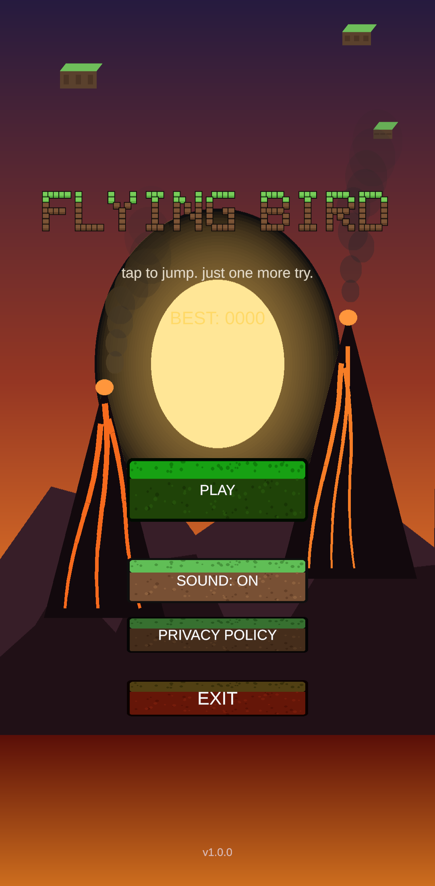
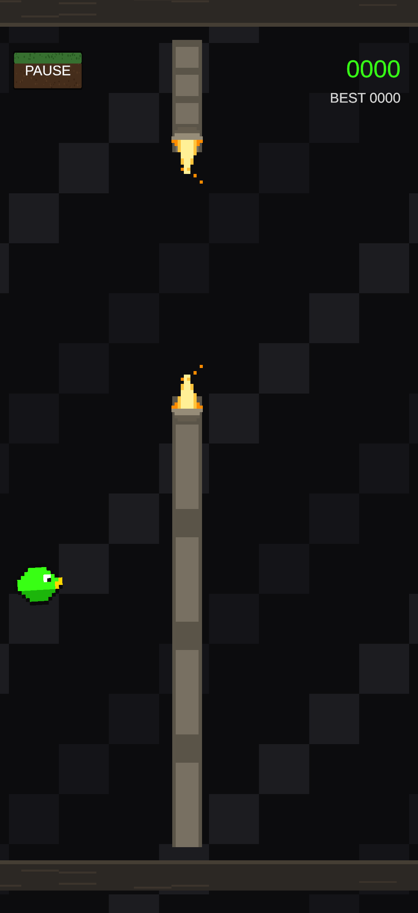
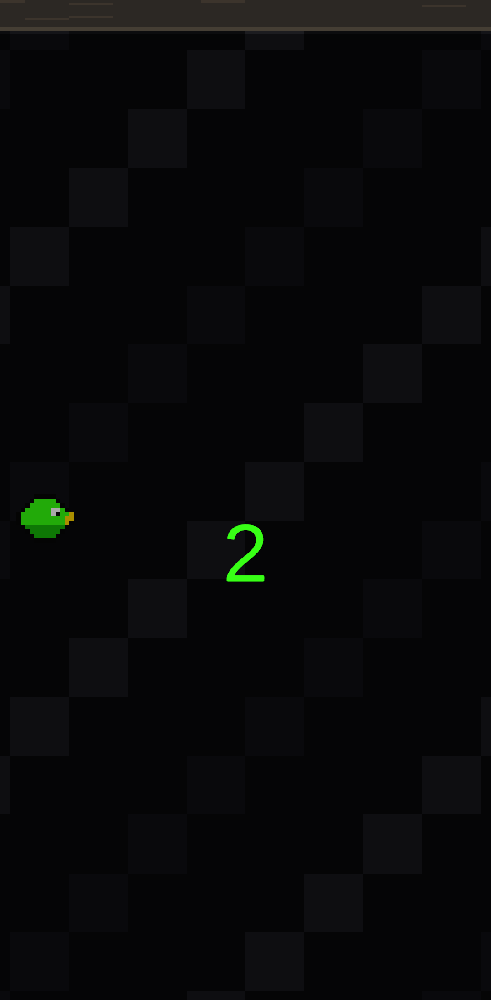
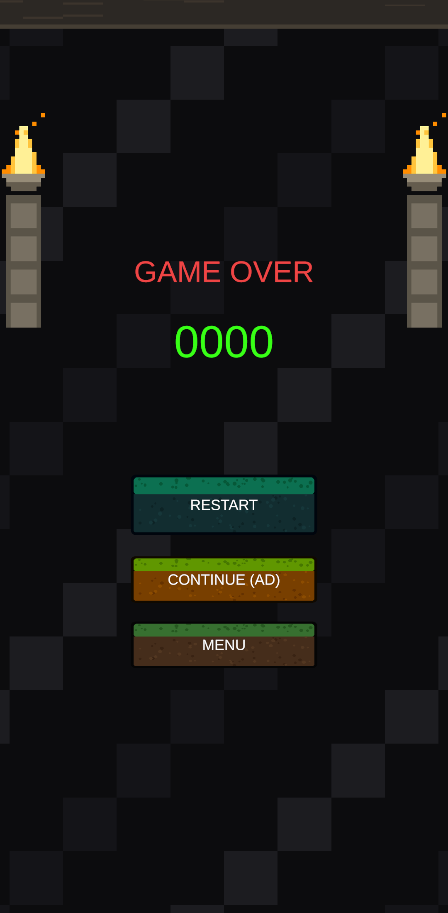

# Flying Bird

A tap-to-fly arcade game for Android, built in Unity. Each tap sets the bird's vertical velocity to a fixed flap strength and gravity pulls it back down. The goal is to fly through the gap between pairs of torch-lit pillars without touching them, the floor or the ceiling. Every 5 points the gap narrows and the pillars speed up, until both reach a limit. The game saves your best score on the device, has a pause button, and lets you watch an optional rewarded ad once per run to continue after dying.

(The repository is called `OneMore` because the project started as a different concept named "One More". It was rebuilt as Flying Bird; see commit `935a218`.)

**Status:** Submitted to Google Play, in review.
Play Store: link coming once approved.

## Screenshots

  
  
  
  

## Tech

- Unity 6000.3.23f1 (`ProjectSettings/ProjectVersion.txt`), C#, uGUI + TextMeshPro
- Android: package `com.onemorestudio.onemore`, min SDK 25, target SDK 36, IL2CPP, ARM64, `GameActivity` entry point
- Google Mobile Ads Unity plugin (11.5.0 per the bundled changelog) for banner, interstitial and rewarded ads, with Google UMP consent
- Local JSON save via `JsonUtility`
- The code includes iOS paths (`ATTManager.cs`, `Assets/Plugins/iOS/ATTBridge.mm`, `HapticsBridge.mm`, `Assets/Editor/IOSBuildPostProcessor.cs`). Only the Android build has been tested and submitted.

## How it's built

Runtime scripts live in `Assets/_Project/Scripts/`. There are three scenes: `Splash`, `MainMenu` and `Gameplay`.

- **Game loop and state.** `Core/GameManager.cs` is a persistent singleton with a `Menu / Countdown / Playing / Paused / GameOver` state machine. Pause sets `Time.timeScale = 0`, which freezes all systems driven by `deltaTime` at once. `OnApplicationFocus` pauses the game automatically if the app loses focus during a run.
- **Player and input.** `Gameplay/PlayerController.cs` reads a mouse click or the start of a touch, sets the velocity of a `Rigidbody2D`, limits rise and fall speed in `FixedUpdate`, and eases the bird's tilt with `Slerp`. Gravity and input stay off until the countdown ends (`BeginFlight`).
- **Obstacles.** `Gameplay/ObstacleSpawner.cs` takes pillar pairs from `Utilities/ObjectPool.cs` and adjusts speed and gap size by score. The spawn interval is `pipeSpacing / speed`, so the distance between pillars stays the same as they get faster. A point is scored when a pair's X position passes the player's.
- **Scoring and persistence.** `Gameplay/ScoreManager.cs` is the only place that owns the score. It applies a small combo multiplier, tracks score milestones for analytics, and writes a new best score through `Core/SaveSystem.cs` the moment it is set. `SaveSystem` stores a JSON file in `Application.persistentDataPath` and keeps it in memory. It uses `JsonUtility` because `BinaryFormatter` is obsolete and unreliable under IL2CPP.
- **Ads.** `Ads/AdManager.cs` wraps the Google Mobile Ads SDK and chooses test or production ad unit IDs per platform. It shows an interstitial on Play (limited to every Nth play), a rewarded ad for Continue (one per run), and banners on the menu, the countdown and Game Over, but not during flight. `Ads/ConsentManager.cs` collects UMP consent before the SDK starts. `GameManager.Start()` runs the startup order: analytics, then consent, then ads.
- **Threading.** `Utilities/MainThreadDispatcher.cs` is a queue, protected by a lock, that runs on `Update`. All AdMob and UMP callbacks go through it (see below).
- **Other.** `Audio/AudioManager.cs`, `Core/HapticManager.cs` (the Android `Vibrator` through `AndroidJavaObject`), `UI/SafeAreaFitter.cs` for notches and cutouts, and `UI/GameplayUIController.cs` and `UI/MainMenuController.cs` for the screens.
- **Editor tooling.** `Assets/Editor/` has the build menu (`BuildScript.cs`), a scene integrity check (`SceneIntegrityCheckEditor.cs`), a screenshot capture tool (`ScreenshotEditor.cs`), and one-off scripts that edited scenes (theme, button wiring fixes).

## Notable problems solved

- **Ad callbacks off the main thread** (`0de5679`, `42a95fc`). On Android, AdMob and UMP callbacks run on a background thread. Closing an interstitial tried to load the Gameplay scene from that thread, which threw an exception and left the player stuck on the menu. I added `MainThreadDispatcher` and sent every callback through it. A follow-up commit fixed the dispatcher's own bug: it had been creating its GameObject lazily inside `Enqueue()`, which could also run off the main thread. It is now created early with `[RuntimeInitializeOnLoadMethod(BeforeSceneLoad)]`.
- **Score-save corruption** (`450416b`). `GameManager` kept its own copy of the score and best score next to `ScoreManager`'s and saved again on every death. Its cached best score never refreshed after loading, so it could overwrite a correct saved best with a lower value. `GameManager` no longer tracks score. `GameOver(finalScore, isNewBest)` now takes its values from `ScoreManager`.
- **Buttons firing twice** (`450416b`). The Restart, Continue and Menu buttons in `Gameplay.unity` each had a persistent Inspector `onClick` and also a listener added in code. For Continue, the second call resumed the game behind the rewarded ad that was still playing, so the bird died while the player couldn't see it. I removed the Inspector bindings so buttons are wired only in code, and added `FixDoubleWiredButtonsEditor.cs` to apply the fix to the scene.
- **Continue and pause flow** (`450416b`). Closing a rewarded ad early never resolved the pending continue callback, so the player was stuck on Game Over with their continue used up. Also, a successful continue never put the state back to `Playing`, so Pause stopped working for the rest of the run. Both are fixed.
- **Crash on launch from the Android manifest** (`2c92ecc`, `088ff61`). The custom `AndroidManifest.xml` pointed to `UnityPlayerActivity`, but the project uses the `GameActivity` entry point, so every launch crashed with `ActivityNotFound`. After switching to `UnityPlayerGameActivity`, a second crash came from the theme: GameActivity needs a `Theme.AppCompat` descendant, so the theme became `BaseUnityGameActivityTheme`.
- **Release signing leaking into dev builds** (`44b5ad1`). `useCustomKeystore` applies to the whole project, so development builds also asked for the release keystore passwords. `BuildScript.cs` now turns it off for dev builds and restores it afterwards.
- **Difficulty spacing** (`0287f27`). With a fixed spawn interval, pillars got farther apart as they sped up, which made the game easier. The interval now depends on speed.
- **Play Console rejection** (`b87d3e8`). The first upload was rejected because the target SDK was 35 (36 is required) and version code 1 was already reserved. I raised the target SDK to 36 and the version code to 2.

## Open and build locally

1. Install Unity 6000.3.23f1 with Android Build Support (SDK, NDK, OpenJDK).
2. In Unity Hub, add this folder as a project and open it. The Google Mobile Ads plugin and External Dependency Manager are already in `Assets/`.
3. Open `Assets/_Project/Scenes/MainMenu.unity` and press Play to run it in the editor.
4. Build from the **Build > Android** menu (`Assets/Editor/BuildScript.cs`):
   - **Development**: an APK signed with Unity's debug key. No keystore needed.
   - **Release App Bundle (Play Store)**: writes `Builds/Android/OneMore_Release.aab`. It needs the upload keystore, which is not committed (it is in `.gitignore`), and the `ONEMORE_KEYSTORE_PASS` / `ONEMORE_KEY_ALIAS_PASS` environment variables. See [RELEASE_SIGNING.md](RELEASE_SIGNING.md) for details and the batch-mode command.

## Docs

- [FINAL_RELEASE_AUDIT.md](FINAL_RELEASE_AUDIT.md): pre-submission audit, on-device test coverage, and bugs found and fixed
- [RELEASE_SIGNING.md](RELEASE_SIGNING.md): keystore handling, version code rules, Play App Signing
- [PLAY_CONSOLE_MANUAL_STEPS.md](PLAY_CONSOLE_MANUAL_STEPS.md): Play Console declarations and closed-testing steps
- [PLAY_STORE_LISTING.md](PLAY_STORE_LISTING.md) and [STORE_ASSETS_CHECKLIST.md](STORE_ASSETS_CHECKLIST.md): store copy and assets
- [PRIVACY_POLICY.md](PRIVACY_POLICY.md) (hosted from [docs/privacy-policy.html](docs/privacy-policy.html) via GitHub Pages)
- [SETUP.md](SETUP.md): original setup guide. It was written before the Flying Bird rebuild, so parts of it (Unity version, scene setup, placeholder ad IDs) are out of date.
